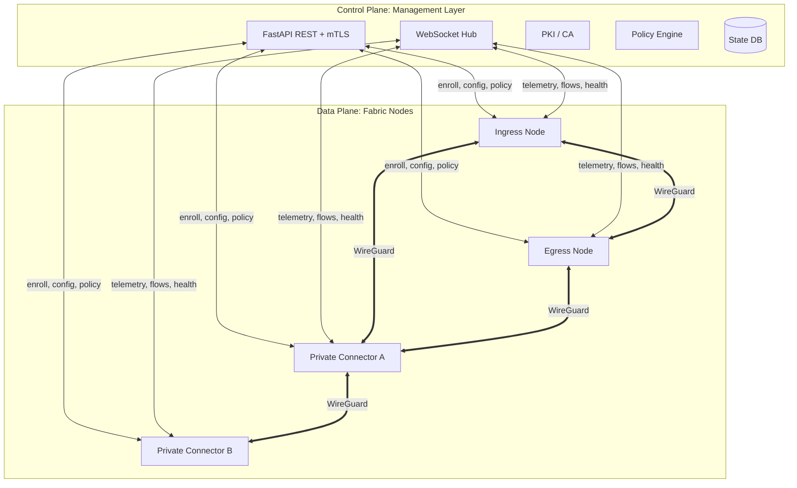

# Fabric Architecture

This document describes the design of the Fabric platform: the control plane
(management layer), the data plane (nodes and the WireGuard fabric), the PKI,
the policy engine, and the real-time model.

---

## 1. Planes

Fabric separates three planes:

- **Control plane** — the management layer. Owns the source of truth (database),
  PKI, policy, node/endpoint lifecycle, and the operator UI. Reachable at
  `fabric.mcnutt.cloud`. Nodes talk to it over an authenticated REST API and a
  persistent WebSocket. The control plane **never carries user traffic**.
- **Data plane** — the nodes. They form a full WireGuard mesh (the *fabric*) and
  forward user/site traffic between each other according to routes and policy
  pushed by the manager.
- **Management/observability plane** — telemetry, flow records, DNS logs, and
  health beacons flow from nodes back to the manager (and its shared data model)
  so the manager can *see* and *inspect* everything without being in the path.



---

## 2. Node roles

Every node runs the same **node-agent** but is assigned a **role** by the
manager. The role selects which data-plane modules activate.

| Role | Purpose | Key modules |
|------|---------|-------------|
| `ingress` | Terminates endpoint tunnels (clients/users). Entry to the fabric. | WireGuard listener, endpoint peers, DNS interception, per-user routing marks |
| `egress` | Sends traffic to the public internet. NAT / masquerade. Dynamic egress IP/region. | NAT44, egress IP pools, TLS inspection, web/DNS monitoring |
| `private-connector` | Bridges a private/corporate network to the fabric (both directions). | Site routes, reverse routes into corp, split-tunnel policy |
| `relay` (optional) | Pure fabric transit for reachability/HA. | Forwarding only |

A single node can hold multiple roles (e.g. a private-connector that is also the
corp-network egress).

---

## 3. The fabric (data plane)

### 3.1 Why WireGuard

WireGuard is the default transport: fast, kernel-native, simple key model,
excellent NAT traversal with `PersistentKeepalive`, and trivial to template.
L2TP/IPsec and OpenVPN are supported for endpoints that cannot run WireGuard;
they terminate on the ingress node and are normalised into the same internal
addressing and policy model.

### 3.2 Addressing

- The fabric uses a dedicated overlay CIDR, default `100.96.0.0/12` (fabric
  underlay for node-to-node) and `100.64.0.0/12` (CGNAT space) for endpoints.
- Each **node** gets a stable fabric address (e.g. `100.96.<site>.<node>`).
- Each **endpoint** gets an address from the ingress node's endpoint pool.
- Private networks are represented as **routes** (`allowed_ips`) advertised by
  their connector node.

### 3.3 Mesh & steering

- The manager computes a **full mesh** of WireGuard peerings between nodes and
  pushes each node its peer list (pubkey, endpoint, allowed_ips, keepalive).
- Routing/forwarding is driven by **fwmark + policy routing tables** (`ip rule`,
  `ip route`), so a packet's *next fabric hop* is chosen by policy (source
  identity/IP + destination). This is how "internet vs private" is separated:
  - dst = internet → mark routes to the **egress** peer
  - dst ∈ private CIDR → mark routes to the owning **private-connector** peer
- The manager recomputes and re-pushes on topology change, node health change,
  or policy change.

### 3.4 Self-healing

- Every node emits a health beacon and pairwise link stats over the WebSocket.
- If a peer link degrades/fails, the manager recomputes paths (e.g. route egress
  via a healthy relay) and re-pushes affected peer configs. Nodes also keep
  last-known-good config locally so they survive manager restarts.

---

## 4. Control plane (management layer)

FastAPI application, structured as:

```
management/app/
  main.py            # app factory, router mounts, static/templates
  config.py          # settings (env-driven)
  database.py        # SQLAlchemy engine/session
  models/            # ORM: nodes, endpoints, policies, pki, fabric, flows, dns
  schemas/           # Pydantic request/response models
  auth/              # McNutt Cloud SSO + API-key verification
  api/               # REST routers (nodes, endpoints, policy, pki, fabric, ...)
  services/          # pki, policy_engine, fabric_orchestrator, config_gen,
                     #   classification, dns_filter, egress, health
  realtime/          # websocket hub + event bus
  web/               # Jinja templates + static (css/js/jQuery), the operator UI
  seed.py            # bootstrap DB + root PKI + demo data
```

### 4.1 High availability

- State lives in a database. SQLite for dev; **PostgreSQL** for production.
- The manager is stateless between requests except for the DB and PKI key
  material, so it scales horizontally behind a load balancer.
- Realtime uses a shared **event bus** (in-process for single node; Redis
  pub/sub across replicas) so any replica can serve any node's WebSocket and
  broadcast to any operator.
- DNS records for `fabric.mcnutt.cloud` and node hostnames are automated via
  **Route53** (see `services/dns_route53.py`).

### 4.2 Updates

- Nodes never self-update from the internet. They pull signed bundles from the
  manager (`/api/v1/nodes/{id}/update`) or are pushed a version to install.
- The manager itself updates from git via `scripts/update.sh` (mirrors the
  `server-manager` pattern): fetch, migrate, restart, health-check, rollback.

---

## 5. PKI

Three hierarchies, all rooted in an offline-style **Fabric Root CA**:

1. **Infrastructure CA** — issues node identity certs (used for mTLS between node
   agents and the manager API, and to authenticate the fabric control channel).
2. **Endpoint CA** — issues endpoint/client certs where a protocol needs them
   (e.g. IKEv2/IPsec, mTLS posture). Also the **trusted root** installed on
   endpoints.
3. **Inspection (MITM) CA** — a separate intermediate whose leaf certs are minted
   on-the-fly by egress nodes to terminate/re-originate TLS for inspection. The
   MITM CA public cert is what gets distributed to endpoints so inspected TLS is
   trusted. Inspection can be **overridden** per policy (bypass = pin passthrough).

Key material for the Root and intermediates is generated and stored by the
manager (`services/pki.py`), encrypted at rest. Nodes receive only the leaf
material and the CA chain they need.

See [`docs/pki.md`](pki.md).

---

## 6. Policy engine

A single engine evaluates every decision. A **policy** is an ordered set of
**rules**; the first matching rule wins (with an explicit default).

**Match on:**
- Identity: user `uid`, `username`, `email`, `roles[]` (from McNutt Cloud).
- Device / source: endpoint id, source IP/CIDR, node/role, posture.
- Destination: IP/CIDR, domain (DNS), URL category, port/protocol.
- Context: time, geo (country), ISP/ASN.

**Actions:**
- `allow` / `deny`
- `inspect` (force TLS MITM) / `bypass` (no inspection)
- `steer` (choose egress node/region, or route to a private connector)
- `redirect` (DNS/HTTP hijack to a URL) / `block-page` (inject a message)
- `log` / `alert`

The engine compiles rules into:
- **Node dataplane hints** (fwmark maps, egress selection) pushed to nodes.
- **Inline decisions** for DNS and HTTP(S) inspection evaluated on the node.

See [`docs/policy.md`](policy.md).

---

## 7. Traffic inspection & classification

- **DNS**: ingress/egress intercept DNS, log qname/qtype, apply category and
  allow/deny/redirect, optionally rewrite answers (hijack) or inject sinkhole.
- **TLS**: egress performs SNI/JA3 classification for all flows; for `inspect`
  flows it terminates TLS using an on-the-fly MITM leaf and re-originates.
- **Classification**: destination IP → GeoIP (country), ASN → ISP, domain → URL
  category, plus behavioural analytics (volume, beaconing, rare-destination).
- Everything is streamed as **flow records** to the manager for the live map and
  analytics.

---

## 8. Real-time model

- Nodes hold a persistent WebSocket to the manager (`/ws/node`).
- Operators' browsers hold a WebSocket to the manager (`/ws/ui`).
- The manager's **event bus** fans node events (flows, health, DNS, alerts) out
  to UI subscribers. The UI uses jQuery to apply diffs to the map, tables, and
  counters so the console feels live.

---

## 9. Security posture

- All control-plane traffic is TLS; node↔manager also uses mTLS with infra certs.
- Operator UI is gated by McNutt Cloud SSO; API by McNutt Cloud API keys.
- Pairing codes are single-use, short-TTL, and bind a node to its enrollment.
- Secrets (CA keys, node psk) encrypted at rest; least-privilege leaf issuance.
- Follows OWASP Top 10 for the web/API surface (authz on every route, input
  validation via Pydantic, no secrets in logs, CSRF-safe state changes).
